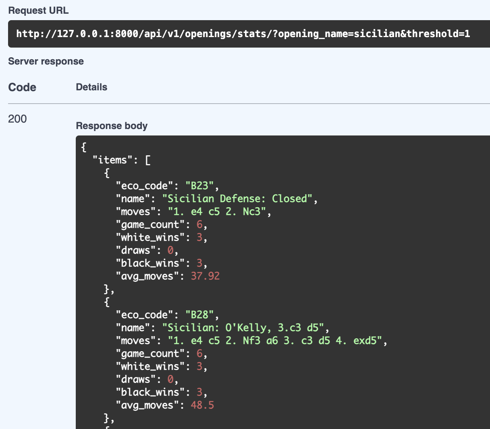

# Chess Explorer API Documentation

This document describes the REST API for the Chess Explorer application.

## Overview

The API is built with Django Ninja and provides endpoints for exploring chess games and opening statistics. The API follows REST conventions and returns JSON responses.

## Base URL

All API endpoints are versioned and accessible at:

```
/api/v1/
```

## Documentation

Interactive API documentation is available at:

- **Swagger UI**: `/api/v1/docs` - Interactive API explorer
- **OpenAPI Schema**: `/api/v1/openapi.json` - Machine-readable API specification

## Authentication

Currently, the API does not require authentication. All endpoints are publicly accessible.

## Endpoints

### Opening Statistics

#### GET /api/v1/openings/stats/

Returns aggregated statistics for chess openings including game counts, win/draw/loss distribution, and average move counts.

**Query Parameters**

| Parameter | Type | Default | Description |
|-----------|------|---------|-------------|
| `white_player` | string | - | Filter games where white player name contains this value (case-insensitive) |
| `black_player` | string | - | Filter games where black player name contains this value (case-insensitive) |
| `any_player` | string | - | Filter games where either player contains this value (OR condition). Takes precedence over `white_player`/`black_player` |
| `eco_code` | string | - | Filter by exact ECO code (e.g. `B20`) |
| `opening_name` | string | - | Filter openings whose name contains this text (case-insensitive) |
| `date_from` | date | - | Lower bound for game date (inclusive, format: YYYY-MM-DD) |
| `date_to` | date | - | Upper bound for game date (inclusive, format: YYYY-MM-DD) |
| `white_elo_min` | integer | - | Minimum white player ELO |
| `white_elo_max` | integer | - | Maximum white player ELO |
| `black_elo_min` | integer | - | Minimum black player ELO |
| `black_elo_max` | integer | - | Maximum black player ELO |
| `threshold` | integer | 1 | Minimum game count required for an opening to appear in results |
| `sort_by` | string | `eco_code` | Sort field: `eco_code`, `name`, `game_count`, `white_pct`, `draw_pct`, `black_pct`, `avg_moves` |
| `order` | string | `asc` | Sort order: `asc` or `desc` |
| `page` | integer | 1 | Page number (1-based) for pagination |
| `page_size` | integer | 25 | Number of items per page |

**Response**

```json
{
  "items": [
    {
      "opening_id": 42,
      "eco_code": "B33",
      "name": "Sicilian: Sveshnikov",
      "moves": "1. e4 c5 2. Nf3 Nc6 3. d4 cxd4 4. Nxd4 Nf6 5. Nc3 e5",
      "game_count": 1523,
      "white_wins": 687,
      "draws": 412,
      "black_wins": 424,
      "white_pct": 45.1,
      "draw_pct": 27.1,
      "black_pct": 27.8,
      "avg_moves": 42.3
    }
  ],
  "total": 847
}
```

**Response Fields**

| Field | Type | Description |
|-------|------|-------------|
| `items` | array | List of opening statistics |
| `items[].opening_id` | integer | Opening primary key (for linking to latest-game) |
| `items[].eco_code` | string | ECO classification code (e.g., "B33") |
| `items[].name` | string | Opening name (e.g., "Sicilian Defense") |
| `items[].moves` | string | Opening move sequence (e.g., "1. e4 c5") |
| `items[].game_count` | integer | Total number of games with this opening |
| `items[].white_wins` | integer | Number of games won by white (result "1-0") |
| `items[].draws` | integer | Number of drawn games (result "1/2-1/2") |
| `items[].black_wins` | integer | Number of games won by black (result "0-1") |
| `items[].white_pct` | float | Percentage of games won by white (rounded) |
| `items[].draw_pct` | float | Percentage of drawn games (rounded) |
| `items[].black_pct` | float | Percentage of games won by black (rounded) |
| `items[].avg_moves` | float | Average number of moves per game (null if no data) |
| `total` | integer | Total count of openings matching the filters (for pagination) |



**Example Requests**

```bash
# Get all opening statistics
curl http://localhost:8000/api/v1/openings/stats/

# Get statistics for a specific player (any color)
curl "http://localhost:8000/api/v1/openings/stats/?any_player=Carlsen"

# Get statistics for high-ELO games only (2700+)
curl "http://localhost:8000/api/v1/openings/stats/?white_elo_min=2700&black_elo_min=2700"

# Get statistics with minimum 10 games per opening
curl "http://localhost:8000/api/v1/openings/stats/?threshold=10"

# Filter by ECO code
curl "http://localhost:8000/api/v1/openings/stats/?eco_code=B20"

# Filter by opening name (substring match)
curl "http://localhost:8000/api/v1/openings/stats/?opening_name=Zukertort%20Opening:%20Arctic"

# Combined filters
curl "http://localhost:8000/api/v1/openings/stats/?white_player=Nakamura&date_from=2024-01-01&threshold=5"

# Sort by white win percentage (descending), page 2, 50 per page
curl "http://localhost:8000/api/v1/openings/stats/?sort_by=white_pct&order=desc&page=2&page_size=50"
```

### Latest game for opening

#### GET /api/v1/openings/{opening_id}/latest-game/

Returns the most recent game (by date, then id) for the given opening. Responds with 404 if the opening has no games or the opening_id is invalid.

**Path Parameters**

| Parameter | Type | Description |
|-----------|------|-------------|
| `opening_id` | integer | Opening primary key |

**Response (200)**

```json
{
  "id": 12345,
  "source_id": "abc123",
  "event": "Titled Tuesday Blitz",
  "site": "Chess.com",
  "date": "2026-01-27",
  "round": "1",
  "white_player": "Player1",
  "black_player": "Player2",
  "result": "1-0",
  "white_elo": 2650,
  "black_elo": 2620,
  "time_control": "180+2",
  "termination": "Checkmate",
  "moves": "1. e4 e5 2. Nf3 ..."
}
```

**Response (404)**

No game found for this opening (or invalid opening_id).

**Example Request**

```bash
curl http://localhost:8000/api/v1/openings/42/latest-game/
```

### Win rate over time

#### GET /api/v1/stats/win-rate-over-time/

Returns time-series points of white/draw/black win percentages by period (week, month, or year). The X axis is derived from `Game.date`. Optional filters: date range, opening (ECO, opening_id, opening_name), player, ELO, and minimum games per period.

**Query Parameters**

| Parameter | Type | Description |
|-----------|------|-------------|
| `period` | string | Time bucket: `week`, `month`, or `year`. Default: `week`. |
| `date_from` | date | Only include games on or after this date (YYYY-MM-DD). |
| `date_to` | date | Only include games on or before this date. |
| `eco_code` | string | Only games with this opening ECO (e.g. B20). |
| `opening_id` | integer | Only games with this opening (primary key). |
| `opening_name` | string | Only games whose opening name contains this (case-insensitive). |
| `any_player` | string | Only games where white or black player name contains this. |
| `white_player` | string | Only games where white player name contains this. |
| `black_player` | string | Only games where black player name contains this. |
| `white_elo_min` / `white_elo_max` | integer | Filter by white ELO. |
| `black_elo_min` / `black_elo_max` | integer | Filter by black ELO. |
| `min_games` | integer | Only return periods with at least this many games (default: 1). |

**Response (200)**

```json
{
  "items": [
    {
      "period": "2024-W01",
      "period_label": "Week of 01 Jan 2024",
      "white_pct": 44.8,
      "draw_pct": 27.3,
      "black_pct": 27.9,
      "game_count": 82
    }
  ]
}
```

**Example Request**

```bash
curl "http://localhost:8000/api/v1/stats/win-rate-over-time/?period=week&date_from=2024-01-01&date_to=2024-01-31&eco_code=B20&min_games=10"
```

## Error Responses

### 422 Unprocessable Entity

Returned when query parameters fail validation.

```json
{
  "detail": [
    {
      "loc": ["query", "threshold"],
      "msg": "value is not a valid integer",
      "type": "type_error.integer"
    }
  ]
}
```

## Architecture

The API follows SOLID principles with clean layer separation:

```
┌────────────────────────────────────────────────────────────────┐
│                      API Layer                                 │
│  chess_core/api/router.py - Thin controllers, request handling │
└────────────────────────────────────────────────────────────────┘
                              │
                              ▼
┌─────────────────────────────────────────────────────────────┐
│                    Schema Layer                             │
│  chess_core/api/schemas.py - Pydantic models for validation │
└─────────────────────────────────────────────────────────────┘
                              │
                              ▼
┌─────────────────────────────────────────────────────────────┐
│                   Service Layer                             │
│  chess_core/services/opening_stats.py - Business logic      │
└─────────────────────────────────────────────────────────────┘
                              │
                              ▼
┌─────────────────────────────────────────────────────────────┐
│                    Data Layer                               │
│  chess_core/models.py - Django ORM models                   │
└─────────────────────────────────────────────────────────────┘
```

### Key Design Decisions

1. **Service Layer Pattern**: Business logic is encapsulated in service classes (`OpeningStatsService`), keeping API controllers thin.

2. **Filter Parameters Dataclass**: Filter parameters use a dataclass (`OpeningStatsFilterParams`) for type safety and default values.

3. **Database Aggregation**: All counting and averaging is done at the database level using Django's `annotate()` with `Count()` and `Avg()`, ensuring optimal performance for large datasets.

4. **Indexed Fields**: Key filter fields (`white_player`, `black_player`, `date`, `white_elo`, `black_elo`, `created_at`) are indexed for efficient queries.

5. **Threshold Filtering**: The threshold filter uses SQL's `HAVING` clause (applied after aggregation) to efficiently exclude low-count openings.

## Performance Considerations

- **Database Indexes**: Filter fields are indexed for O(log n) lookups
- **Single Query**: All aggregation happens in a single database query
- **Lazy Evaluation**: QuerySets are evaluated lazily, allowing the database to optimize
- **Move Count Caching**: `move_count_ply` is stored on the `Game` model to avoid runtime calculation

## Versioning

The API uses URL-based versioning (`/api/v1/`). Future breaking changes will be introduced under a new version prefix (e.g., `/api/v2/`).

## Future Endpoints

Planned endpoints for future releases:

- `GET /api/v1/chess_core/` - List/search games with pagination
- `GET /api/v1/chess_core/{id}/` - Get single game details with moves
- `GET /api/v1/players/stats/` - Player statistics (win rates, opening preferences)
- `POST /api/v1/chess_core/upload/` - Upload PGN games
