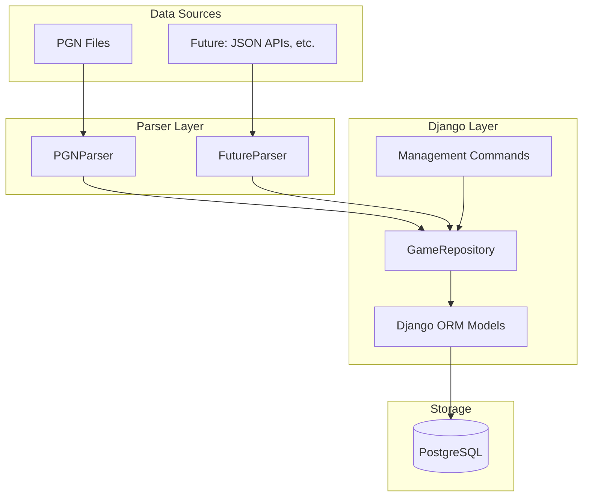

# Chess Explorer

A Django application for ingesting and storing chess games from various formats, built with SOLID principles for extensibility.

## Features

- Import chess games from PGN files
- Store games in PostgreSQL (or SQLite for development)
- Extensible parser architecture for adding new formats
- Django admin interface for browsing games
- Batch import with deduplication

## Architecture



### SOLID Principles

- **Single Responsibility**: Parsers only parse, Repository handles persistence, Django models define schema
- **Open/Closed**: Add new formats by implementing `GameParser` protocol without modifying existing code
- **Liskov Substitution**: All parsers yield `GameData` dataclasses; repository accepts them uniformly
- **Interface Segregation**: Small protocols (`GameParser`) - parsers don't need to know about Django
- **Dependency Inversion**: Parsers produce plain dataclasses, not Django models - core parsing logic is framework-agnostic

## Installation

Requires Python 3.13+ and [uv](https://docs.astral.sh/uv/).

```bash
# Clone the repository
git clone <repository-url>
cd chess-explorer

# Install dependencies
uv sync

# Run migrations
uv run python manage.py migrate
```

## Configuration

### Database

By default, the application uses SQLite for development. For PostgreSQL, set environment variables:

```bash
export DATABASE_URL=1  # Enables PostgreSQL mode
export POSTGRES_DB=chess_explorer
export POSTGRES_USER=postgres
export POSTGRES_PASSWORD=your_password
export POSTGRES_HOST=localhost
export POSTGRES_PORT=5432
```

### Secret Key

For production, set a secure secret key:

```bash
export DJANGO_SECRET_KEY=your-secure-secret-key
```

## Usage

### Import Games

```bash
# Import a PGN file
uv run python manage.py import_games games.pgn

# Import with explicit format
uv run python manage.py import_games data.json --format lichess

# Specify batch size
uv run python manage.py import_games large_file.pgn --batch-size 500
```

### Admin Interface

```bash
# Create admin user
uv run python manage.py createsuperuser

# Start development server
uv run python manage.py runserver

# Visit http://localhost:8000/admin/games/game/
```

## Project Structure

```
chess-explorer/
├── manage.py
├── pyproject.toml
├── chess_explorer/          # Project settings
│   ├── settings.py
│   ├── urls.py
│   └── wsgi.py
└── games/                   # Django app
    ├── models.py            # Game model
    ├── admin.py             # Admin interface
    ├── repositories.py      # GameRepository
    ├── parsers/
    │   ├── base.py          # GameParser protocol + GameData
    │   └── pgn.py           # PGN parser
    └── management/commands/
        └── import_games.py  # CLI command
```

## Adding New Formats

To add support for a new format (e.g., Lichess JSON):

1. Create a new parser in `games/parsers/`:

```python
# games/parsers/lichess.py
from pathlib import Path
from typing import Iterator
from .base import GameData

class LichessParser:
    def parse(self, source: Path | str) -> Iterator[GameData]:
        # Parse the source and yield GameData objects
        ...
```

2. Register the parser in `games/management/commands/import_games.py`:

```python
def _get_parser(self, file_format: str):
    parsers = {
        "pgn": PGNParser,
        "lichess": LichessParser,  # Add new parser
    }
    ...
```

No changes needed to the repository or models.

## Dependencies

- `django` - Web framework with ORM
- `psycopg[binary]` - PostgreSQL adapter
- `python-chess` - PGN parsing

## Development

```bash
# Run linter
uv run ruff check .

# Format code
uv run ruff format .

# Run tests
uv run python manage.py test
```

## License

[Add your license here]
