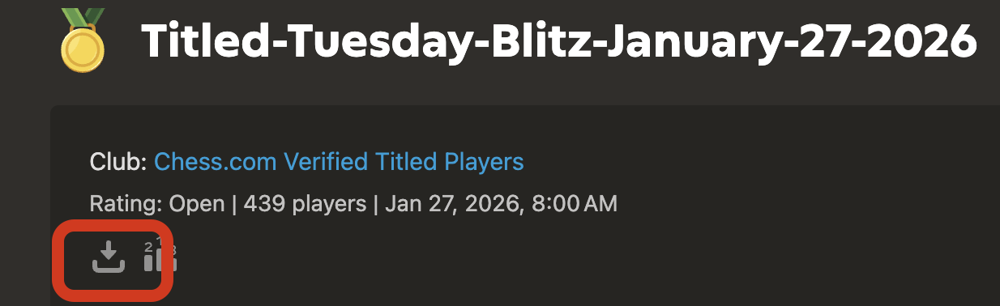
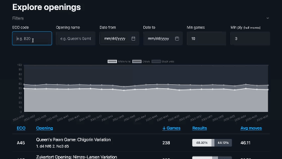

# Chess Explorer

A Django application for ingesting, analyzing, and exploring chess games with large datasets.

Note for getting data: Any PGN file will do, but you can download PGN games from "Titled Tuesday" here for example https://www.chess.com/tournament/live/titled-tuesday-blitz-january-27-2026-6170439




## Features

- Import chess games from PGN files
- Automatic opening detection using ECO (Encyclopedia of Chess Openings) classification
- Store games in PostgreSQL (or SQLite for development)
- Extensible parser architecture for adding new formats for data intake
- Django admin interface for browsing games
- **HTMX explorer** at `/explore/` for opening statistics (filters, sort, pagination, result bar charts)
- API for fetching filtered data sets (sorting, pagination, normalized percentages)
- Batch import with deduplication

## Architecture


### SOLID Principles

- **Single Responsibility**: Parsers only parse, Repository handles persistence, Django models define schema
- **Open/Closed**: Add new formats by implementing `GameParser` protocol without modifying existing code
- **Liskov Substitution**: All parsers yield `GameData` dataclasses; repository accepts them uniformly
- **Interface Segregation**: Small protocols (`GameParser`) - parsers don't need to know about Django
- **Dependency Inversion**: Parsers produce plain dataclasses, not Django models - core parsing logic is framework-agnostic

The explorer UI (including the opening board preview) is presentation-only: it consumes view context (e.g. `row.moves`) and does not introduce new backend responsibilities.

## Opening Detection

Games are automatically classified using the Encyclopedia of Chess Openings (ECO) system. The detector replays each game's moves and matches positions against ~15,800 known opening positions.

### How It Works

1. ECO data is loaded from JSON files into the `Opening` table
2. When importing games, each position is checked against known openings
3. The deepest (most specific) matching opening is assigned to the game


### ECO Classification

- **A00-A99**: Flank openings (English, Reti, Bird)
- **B00-B99**: Semi-open games (Sicilian, Caro-Kann, Pirc)
- **C00-C99**: Open games (Italian, Ruy Lopez, French)
- **D00-D99**: Closed games (Queen's Gambit)
- **E00-E99**: Indian defenses (King's Indian, Nimzo-Indian)

### Data Model

```python
class Opening(models.Model):
    fen = models.CharField(unique=True)      # Position identifier
    eco_code = models.CharField()            # e.g., "B33"
    name = models.CharField()                # e.g., "Sicilian: Sveshnikov"
    moves = models.CharField()               # e.g., "1. e4 c5 2. Nf3 Nc6..."
    ply_count = models.IntegerField()        # Depth in half-moves

class Game(models.Model):
    opening = models.ForeignKey(Opening)     # Detected opening
    # ... other fields
```

## Installation

Requires Python 3.13+ and [uv](https://docs.astral.sh/uv/).

```bash
# Clone the repository
git clone <repository-url>
cd chess-explorer

# Install dependencies
uv sync

# Run migrations
uv run python manage.py migrate
```

## Configuration

### Database

By default, the application uses SQLite for development. For PostgreSQL, set environment variables:

```bash
export DATABASE_URL=1  # Enables PostgreSQL mode
export POSTGRES_DB=chess_explorer
export POSTGRES_USER=postgres
export POSTGRES_PASSWORD=your_password
export POSTGRES_HOST=localhost
export POSTGRES_PORT=5432
```

### Secret Key

For production, set a secure secret key:

```bash
export DJANGO_SECRET_KEY=your-secure-secret-key
```

## Usage

### Initial Setup

```bash
# Run migrations
uv run python manage.py migrate

# Load ECO opening database (~15,800 positions)
uv run python manage.py load_openings
```

### Import Games

```bash
# Import a PGN file (openings detected automatically)
uv run python manage.py import_games games.pgn

# Import with explicit format
uv run python manage.py import_games data.json --format lichess

# Specify batch size
uv run python manage.py import_games large_file.pgn --batch-size 500
```

### Backfill Openings

For games imported before opening detection was enabled:

```bash
# Detect openings for games without them
uv run python manage.py detect_openings

# Re-detect all games (force mode)
uv run python manage.py detect_openings --force

# Specify batch size
uv run python manage.py detect_openings --batch-size 500
```

### Admin Interface

```bash
# Create admin user
uv run python manage.py createsuperuser

# Start development server
uv run python manage.py runserver

# Visit http://localhost:8000/admin/chess_core/game/
```

### Explore Openings (HTMX UI)

A server-rendered explorer at `/explore/` lets you filter and sort opening statistics with instant updates (HTMX). It uses the same service layer as the API.

```bash
uv run python manage.py runserver
# Visit http://localhost:8000/explore/
```

- **Filters**: ECO code, opening name, date range, minimum games
- **Sorting**: By ECO, opening name, games, results (white/black win %), avg moves
- **Pagination**: Page size 25 (default), previous/next
- **Results**: 100% stacked bar with white/draw/black percentages per opening

## Project Structure

```
chess-explorer/
├── manage.py
├── pyproject.toml
├── uv.lock
├── API.md                   # REST API documentation
├── chess_explorer/          # Project settings
│   ├── settings.py
│   ├── urls.py
│   ├── asgi.py
│   └── wsgi.py
├── flowcharts/              # Architecture diagrams
└── chess_core/              # Django app
    ├── models.py            # Game and Opening models
    ├── admin.py             # Admin interface
    ├── views.py
    ├── templates/           # HTMX explorer (base, explore, partials)
    ├── repositories.py      # GameRepository
    ├── api/                 # Django Ninja REST API (v1)
    │   ├── router.py        # Endpoints (e.g. /openings/stats/)
    │   └── schemas.py       # Pydantic request/response schemas
    ├── parsers/
    │   ├── base.py          # GameParser protocol + GameData
    │   └── pgn.py           # PGN parser
    ├── services/
    │   ├── openings.py      # OpeningDetector service
    │   └── opening_stats.py # Aggregated opening statistics
    ├── data/                # ECO opening data (JSON)
    │   ├── ecoA.json … ecoE.json
    │   └── eco_interpolated.json
    ├── migrations/
    ├── management/commands/
    │   ├── import_games.py
    │   ├── load_openings.py
    │   ├── detect_openings.py
    │   └── backfill_move_count.py
    └── tests/
```

## Adding New Formats

To add support for a new format (e.g., Lichess JSON):

1. Create a new parser in `chess_core/parsers/`:

```python
# chess_core/parsers/lichess.py
from pathlib import Path
from typing import Iterator
from .base import GameData

class LichessParser:
    def parse(self, source: Path | str) -> Iterator[GameData]:
        # Parse the source and yield GameData objects
        ...
```

2. Register the parser in `chess_core/management/commands/import_games.py`:

```python
def _get_parser(self, file_format: str):
    parsers = {
        "pgn": PGNParser,
        "lichess": LichessParser,  # Add new parser
    }
    ...
```

No changes needed to the repository or models.

## Dependencies

- `django` - Web framework with ORM
- `django-ninja` - REST API framework
- `psycopg[binary]` - PostgreSQL adapter
- `python-chess` - PGN parsing

No front-end build step: the explorer uses HTMX (CDN) and Pico CSS (CDN).

## Development

```bash
# Run linter
uv run ruff check .

# Format code
uv run ruff format .

# Run tests (project uses pytest)
uv run pytest
```

## License

MIT
